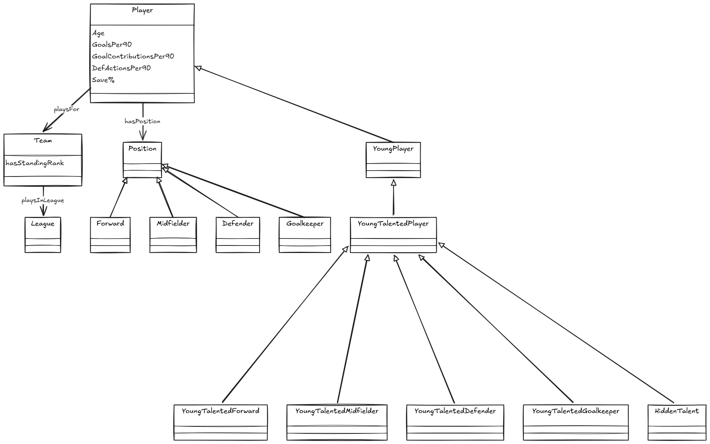

# Football Talent Knowledge Graph Ontology

## Overview

This ontology defines the conceptual model of the Football Talent Knowledge Graph.

The graph integrates football player statistics and league standings, then enriches them through rule-based reasoning to identify:

* young players
* young talented players
* hidden talents

The ontology separates:

* explicit knowledge loaded from the datasets
* inferred knowledge created by reasoning rules

---

## Ontology Diagram



**Figure 1.** Ontology of the Football Talent Knowledge Graph, including core entities, relationships, position hierarchy, and inferred talent classes.

---

## Core Classes

### Player

Represents an individual football player.

Examples:

* Lamine Yamal
* Harry Kane
* Kenan Yildiz
* Max Weiss

Important properties:

* `hasName`
* `hasAge`
* `hasNation`
* `hasMinutes90s`
* `hasGoalsPer90`
* `hasAssistsPer90`
* `hasGoalContributionsPer90`
* `hasDefActionsPer90`
* `hasSavePercentage`

Important relationships:

* `playsFor -> Team`
* `hasPosition -> Position`

### Team

Represents a football club.

Examples:

* Barcelona
* Arsenal
* Bayern Munich
* Inter

Important properties:

* `hasName`
* `hasStandingRank`

Important relationships:

* `playsInLeague -> League`

### League

Represents a football competition.

Examples:

* Premier League
* La Liga
* Bundesliga
* Serie A
* Ligue 1

Important properties:

* `hasName`

---

## Position Hierarchy

### Position

Represents a player's football role.

Subclasses:

* `Forward`
* `Midfielder`
* `Defender`
* `Goalkeeper`

These classes are modeled as subclasses of `Position`.

---

## Talent Classification Hierarchy

The following classes are inferred during reasoning. They do not appear directly in the source CSV files.

### YoungPlayer

Represents players aged 21 or younger.

Rule:

```text
Age <= 21
```

### YoungTalentedPlayer

Represents a young player who satisfies at least one position-specific talent rule.

This class is the parent class of all position-specific talent classes.

### YoungTalentedForward

Rule:

```text
YoungPlayer
AND Position = Forward
AND 90s >= 10
AND GoalsPer90 >= 0.398
```

### YoungTalentedMidfielder

Rule:

```text
YoungPlayer
AND Position = Midfielder
AND 90s >= 10
AND GoalContributionsPer90 >= 0.496
```

### YoungTalentedDefender

Rule:

```text
YoungPlayer
AND Position = Defender
AND 90s >= 10
AND DefActionsPer90 >= 2.812
```

### YoungTalentedGoalkeeper

Rule:

```text
YoungPlayer
AND Position = Goalkeeper
AND 90s >= 3
AND Save% >= 76.520
```

### HiddenTalent

Represents talented young players who perform at a high level despite playing for lower-ranked clubs.

Rule:

```text
YoungTalentedPlayer
AND TeamStandingRank > 10
```

Purpose:

Identify potentially undervalued players for football scouting.

---

## Core Relationships

### playsFor

Connects a `Player` to a `Team`.

Example:

```text
Lamine Yamal -> playsFor -> Barcelona
```

### playsInLeague

Connects a `Team` to a `League`.

Example:

```text
Barcelona -> playsInLeague -> La Liga
```

### hasPosition

Connects a `Player` to one or more position classes.

Example:

```text
Pedri -> hasPosition -> Midfielder
```

### hasStandingRank

Connects a `Team` to its league standing.

Example:

```text
Barcelona -> hasStandingRank -> 1
```

---

## Design Rationale

The ontology is intentionally lightweight and task-oriented.

Explicit knowledge is used to represent:

* players
* teams
* leagues
* positions
* standings
* player statistics

Inferred knowledge is used to represent:

* young players
* talented players by position
* hidden talents

This separation is important because the project does not only store football data; it also derives new scouting knowledge from it through logical rules.
